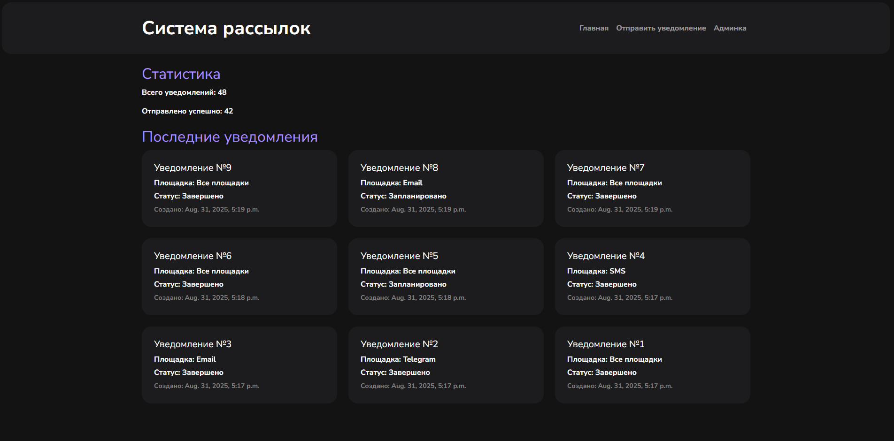
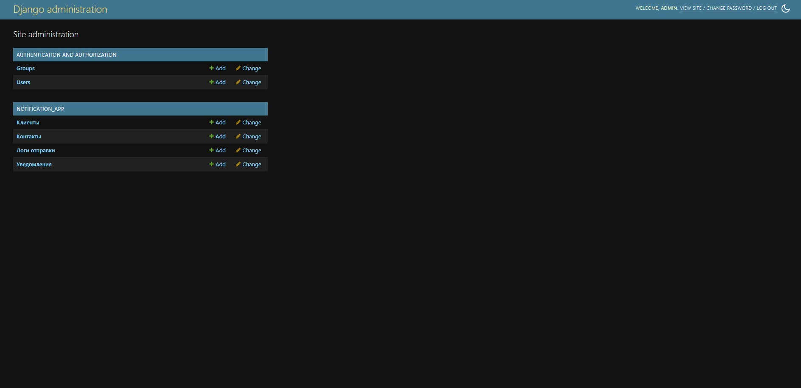
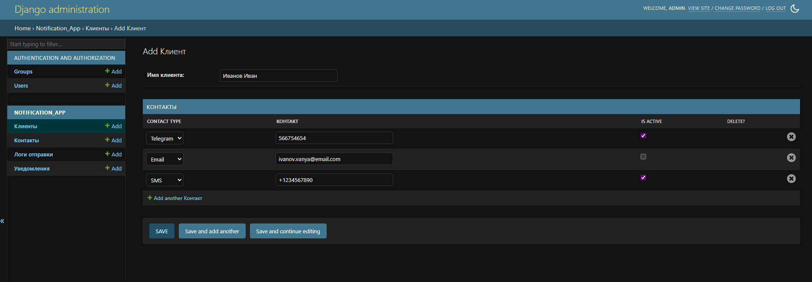
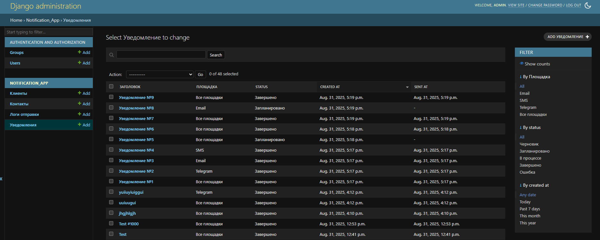
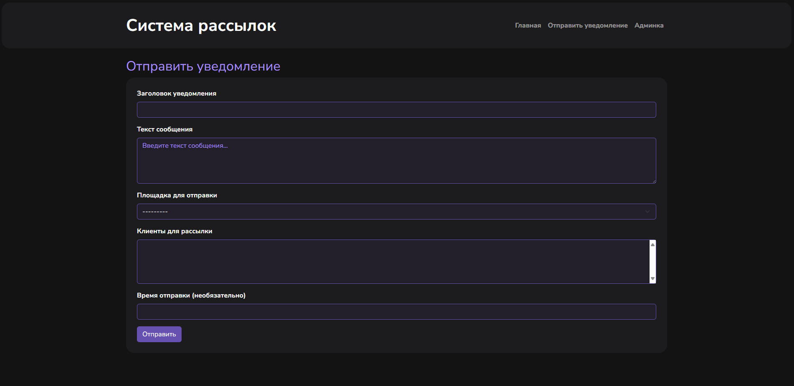
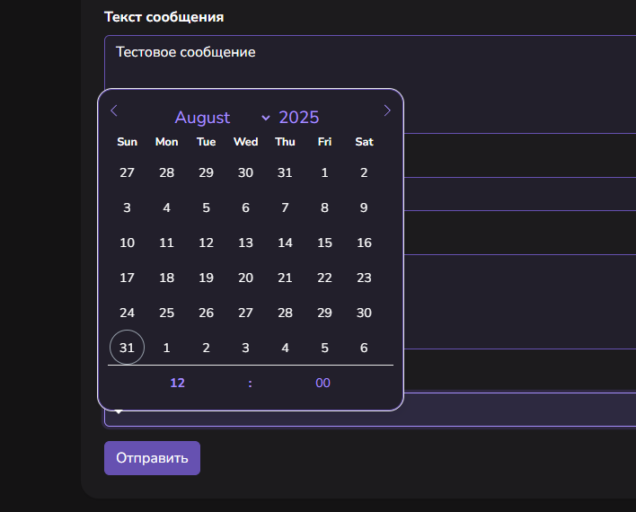
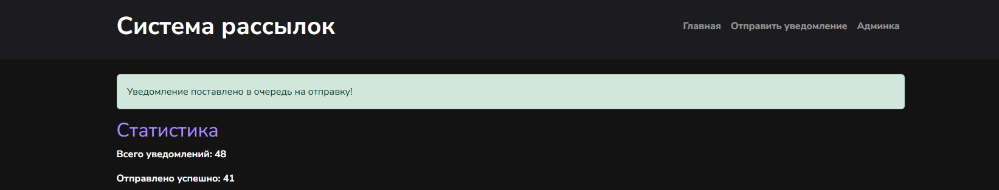

# Telegram-SMS-Email-sender

**Веб-приложение на Python для массовой рассылки сообщений по EMAIL, Telegram и SMS. С возможностью выбора метода отправки, истории действий пользователя, а также редактором отложенных уведомлений.**

## Зависимости:

- amqp 5.3.1
- asgiref 3.9.1
- billiard 4.2.1
- celery 5.5.3
- certifi 2025.8.3
- charset-normalizer 3.4.3
- click 8.2.1
- click-didyoumean 0.3.1
- click-plugins 1.1.1.2
- click-repl 0.3.0
- colorama 0.4.6
- Django 5.2.5
- django-widget-tweaks 1.5.0
- dotenv 0.9.9
- idna 3.10
- kombu 5.5.4
- packaging 25.0
- prompt_toolkit 3.0.52
- python-dateutil 2.9.0.post0
- python-dotenv 1.1.1
- redis 6.4.0
- requests 2.32.5
- six 1.17.0
- sqlparse 0.5.3
- tzdata 2025.2
- urllib3 2.5.0
- vine 5.1.0
- wcwidth 0.2.13

## Начальная настройка через .env
```env
SECRET_KEY='ваш-Django-ключ'
DATABASE_URL='ссылка-на-вашу-базу-данных'

EMAIL_HOST='ссылка-на-ваш-SMTP'
EMAIL_PORT=587
EMAIL_HOST_USER='ваша-электронная-почта'
EMAIL_HOST_PASSWORD='ваш-пароль-от-SMTP'

TELEGRAM_BOT_TOKEN='ваш-токен-для-telegram-бота'

SMS_ACCOUNT_SID='SID-вашего-аккаунта'
SMS_AUTH_TOKEN='ваш-токен'
SMS_FROM_NUMBER='ваш-номер-телефона'

REDIS_URL='ссылка-на-redis'
```

# Скриншоты приложения

## Главная страница



На главной странице отображаются последние 9 уведомлений и статистика.

## Панель администратора



**Функции панели администратора:**
- Добавление новых клиентов
- Добавление контактов клиентов
- Мониторинг процесса отправки
- Редактирование запланированных уведомлений
- Изменение статуса контакта (нужно, если клиент попросил не отправлять уведомления на один из каналов связи)
- Удаление (относится к: клиентам, контактам, уведомлениям, администраторам и пользователям приложения)

## Создание нового клиента



## Просмотр логов



## Страница отправки



После добавления новых контактов в поле "Контакты для рассылки", появятся имена ранее созданных клиентов для выборочной отправки. По умолчанию выбраны все.

Для отложенной отправки предусмотрен выбор даты, если не заполнять это поле, то отправка произойдёт сразу.



При нажатии кнопки "Отправить", произойдёт редирект на главную страницу, и будет отображено уведомление.



## Запуск 

1. Установить Python
2. Установить Redis
3. Создать директорию проекта
```
mkdir your-project
```
4. Клонировать проект
```
git clone https://github.com/kenichiyamazaki/Telegram-SMS-Email-sender
```
5. Поднять вирутальную среду со всеми зависимостями (файл с ними располагается по пути "Telegram-SMS-Email-sender\NotificationSystem\requirements.txt")
```
python -m venv .your-venv

cd ./NotificationSystem

.your-venv/Scripts/Activate.ps1 # для Windows
source .your-venv/bin/activate # для macOS/GNU Linux

pip install -r requirements.txt
```

6. Создать и заполнить файл .env по примеру
7. Запустить Celery
```
celery -A NotificationSystem worker -l info --pool=solo
# Пул solo нужен для запуска одним процессом, иначе Windows закроет ему доступ
```
8. Запустить миграции
```
python manage.py migrate
python manage.py makemigrations notification_app
```
9. Создать админа
```
python manage.py createsuperuser
```
10. Запустить приложение
```
python manage.py runserver
```

***Поздравляю, приложение запущено! В консоли можно перейти по ссылке и пользоваться**


